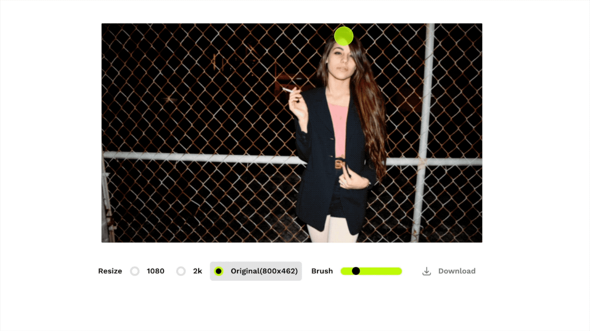

# Lama-cleaner: Image inpainting tool powered by [LaMa](https://github.com/saic-mdal/lama)

This project is mainly used for selfhosting LaMa model, some interaction improvements may be added later.



- [x] High resolution support
- [x] Multi stroke support. Press and hold the `cmd/ctrl` key to enable multi stroke mode.
- [ ] Keep image EXIF data

## Quick Start

- Install requirements: `pip3 install -r requirements.txt`
- Start server: `python3 main.py --device=cuda --port=8080`

## Development

Only needed if you plan to modify the frontend and recompile yourself.

### Fronted

Frontend code are modified from [cleanup.pictures](https://github.com/initml/cleanup.pictures),
You can experience their great online services [here](https://cleanup.pictures/).

- Install dependencies:`cd lama_cleaner/app/ && yarn`
- Start development server: `yarn dev`
- Build: `yarn build`

## Docker

Run within a Docker container. Set the `CACHE_DIR` to models location path.
Optionally add a `-d` option to the `docker run` command below to run as a daemon.

### Build Docker image

```
docker build -f Dockerfile -t lamacleaner .
```

### Run Docker (cpu)

```
docker run -p 8080:8080 -e CACHE_DIR=/app/models -v  $(pwd)/models:/app/models -v $(pwd):/app --rm lamacleaner python3 main.py --device=cpu --port=8080
```

### Run Docker (gpu)

```
docker run --gpus all -p 8080:8080 -e CACHE_DIR=/app/models -v $(pwd)/models:/app/models -v $(pwd):/app --rm lamacleaner python3 main.py --device=cuda --port=8080
```

Then open [http://localhost:8080](http://localhost:8080)
