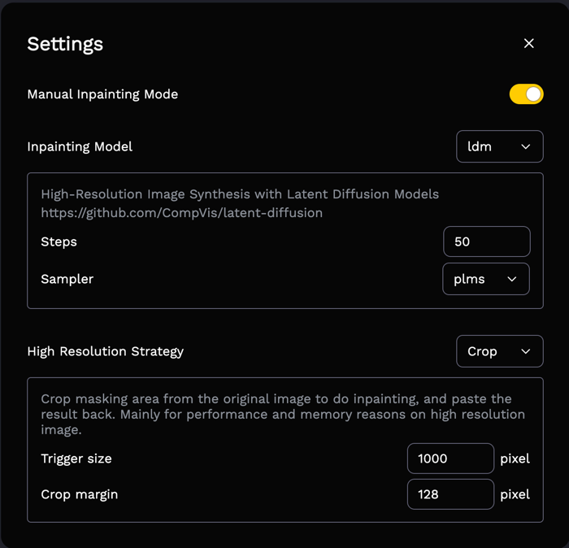

# Lama-cleaner: Image inpainting tool powered by SOTA AI model

[](https://pepy.tech/project/lama-cleaner)
[](https://pepy.tech/project/lama-cleaner)

<a href="https://colab.research.google.com/drive/1e3ZkAJxvkK3uzaTGu91N9TvI_Mahs0Wb?usp=sharing" target="_parent"></a>


https://user-images.githubusercontent.com/3998421/153323093-b664bb68-2928-480b-b59b-7c1ee24a4507.mp4

- [x] Support multiple model architectures
  1. [LaMa](https://github.com/saic-mdal/lama)
  1. [LDM](https://github.com/CompVis/latent-diffusion)
- [x] Support CPU & GPU
- [x] High resolution support
- [x] Run as a desktop APP
- [x] Multi stroke support. Press and hold the `cmd/ctrl` key to enable multi stroke mode.
- [x] Zoom & Pan

## Install

```bash
pip install lama-cleaner

lama-cleaner --device=cpu --port=8080
```

Available commands:

| Name       | Description                                      | Default  |
| ---------- | ------------------------------------------------ | -------- |
| --model    | lama or ldm. See details in **Model Comparison** | lama     |
| --device   | cuda or cpu                                      | cuda     |
| --gui      | Launch lama-cleaner as a desktop application     |          |
| --gui_size | Set the window size for the application          | 1200 900 |
| --input    | Path to image you want to load by default        | None     |
| --port     | Port for flask web server                        | 8080     |
| --debug    | Enable debug mode for flask web server           |          |

## Settings

You can change the configs of inpainting process in the settings interface of the web page.



###  Inpainting Model

Select the inpainting model to use, and set the configs corresponding to the model.

LaMa model has no configs that can be specified at runtime. 

LDM model has two configs to control the quality of final result:
1. Steps: You can get better result with large steps, but it will be more time-consuming
2. Sampler: ddim or [plms](https://arxiv.org/abs/2202.09778). In general plms can get better results with fewer steps


### High Resolution Strategy

There are three strategies for handling high-resolution images.

- **Original**: Use the original resolution of the picture, suitable for picture size below 2K.
- **Resize**: Resize the longer side of the image to a specific size(keep ratio), then do inpainting on the resized image. 
The inpainting result will be pasted back on the original image to make sure other part of image not loss quality.
- **Crop**: Crop masking area from the original image to do inpainting, and paste the result back.
Mainly for performance and memory reasons on high resolution image. This strategy may give better results for ldm model.


## Model Comparison

| Model | Pron                                                                                                                                    | Corn                                                                                           |
|-------|-----------------------------------------------------------------------------------------------------------------------------------------|------------------------------------------------------------------------------------------------|
| LaMa  | - Perform will on high resolution image(~2k)<br/> - Faster than diffusion model                                                         |                                                                                                |
| LDM   | - It's possible to get better and more detail result, see example below<br/> - The balance of time and quality can be achieved by steps | - Slower than GAN model<br/> - Need more GPU memory<br/> - Not good for high resolution images |

| Original Image                                                                                                                            | LaMa                                                                                                                                                   | LDM                                                                                                                                                   |
| ----------------------------------------------------------------------------------------------------------------------------------------- | ------------------------------------------------------------------------------------------------------------------------------------------------------ | ----------------------------------------------------------------------------------------------------------------------------------------------------- |
|  |  |  |

Blogs about diffusion models:

- https://lilianweng.github.io/posts/2021-07-11-diffusion-models/
- https://yang-song.github.io/blog/2021/score/

## Development

Only needed if you plan to modify the frontend and recompile yourself.

### Frontend

Frontend code are modified from [cleanup.pictures](https://github.com/initml/cleanup.pictures), You can experience their
great online services [here](https://cleanup.pictures/).

- Install dependencies:`cd lama_cleaner/app/ && yarn`
- Start development server: `yarn start`
- Build: `yarn build`

## Docker

Run within a Docker container. Set the `CACHE_DIR` to models location path. Optionally add a `-d` option to
the `docker run` command below to run as a daemon.

### Build Docker image

```
docker build -f Dockerfile -t lamacleaner .
```

### Run Docker (cpu)

```
docker run -p 8080:8080 -e CACHE_DIR=/app/models -v  $(pwd)/models:/app/models -v $(pwd):/app --rm lamacleaner python3 main.py --device=cpu --port=8080
```

### Run Docker (gpu)

```
docker run --gpus all -p 8080:8080 -e CACHE_DIR=/app/models -v $(pwd)/models:/app/models -v $(pwd):/app --rm lamacleaner python3 main.py --device=cuda --port=8080
```

Then open [http://localhost:8080](http://localhost:8080)

## Like My Work?

<a href="https://www.buymeacoffee.com/Sanster"> 
  
</a>
