<h1 align="center">Lama Cleaner</h1>
<p align="center">A free and open-source inpainting tool powered by SOTA AI model.</p>

<p align="center">
  <a href="https://github.com/Sanster/lama-cleaner">
    
  </a>
  <a href="https://pypi.org/project/lama-cleaner/">
    
  </a>
  <a href="https://colab.research.google.com/drive/1e3ZkAJxvkK3uzaTGu91N9TvI_Mahs0Wb?usp=sharing">
    
  </a>
  <a href="https://hub.docker.com/r/cwq1913/lama-cleaner">
    
  </a>
</p>

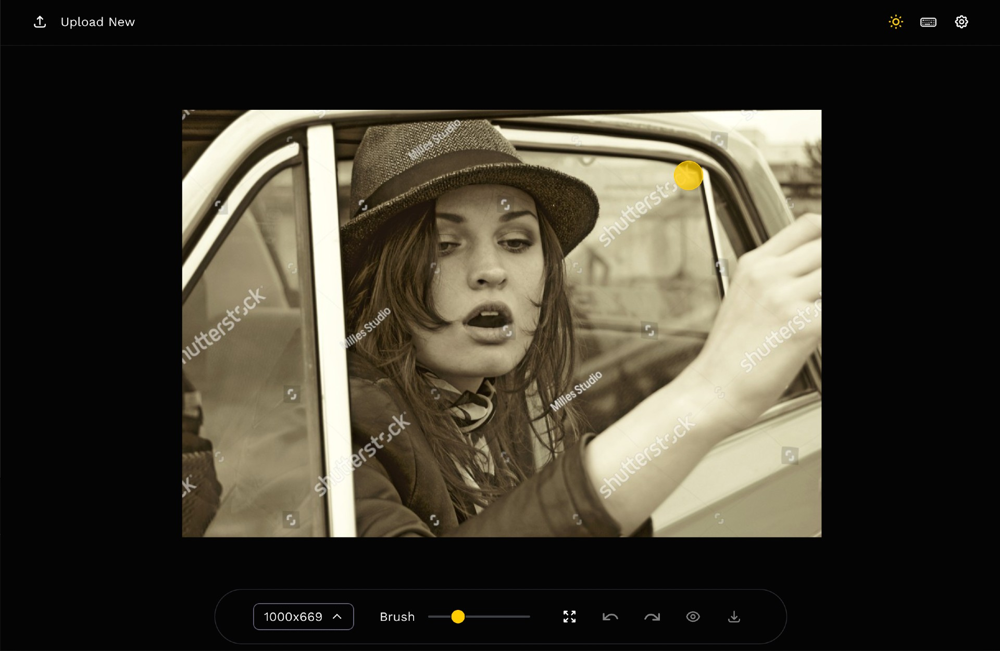

## Features

- Completely free and open-source
- Fully self-hosted
- Classical image inpainting algorithm powered by [cv2](https://docs.opencv.org/3.4/df/d3d/tutorial_py_inpainting.html)
- Multiple SOTA AI models
  1. [LaMa](https://github.com/saic-mdal/lama)
  1. [LDM](https://github.com/CompVis/latent-diffusion)
  1. [ZITS](https://github.com/DQiaole/ZITS_inpainting)
  1. [MAT](https://github.com/fenglinglwb/MAT)
  1. [FcF](https://github.com/SHI-Labs/FcF-Inpainting)
  1. [SD1.4](https://github.com/CompVis/stable-diffusion)
- Support CPU & GPU
- Various inpainting [strategy](#inpainting-strategy)
- Run as a desktop APP

## Usage

<details>
<summary>1. Remove any unwanted things on the image</summary>

| Usage                  | Before                                        | After                                               |
| ---------------------- | --------------------------------------------- | --------------------------------------------------- |
| Remove unwanted things | 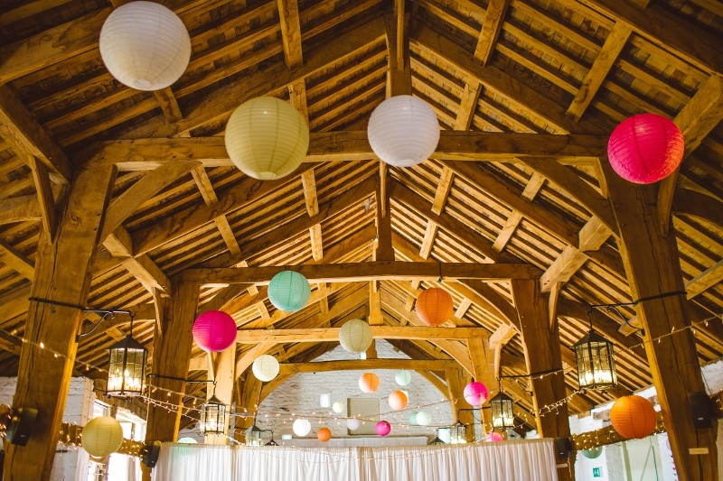 | 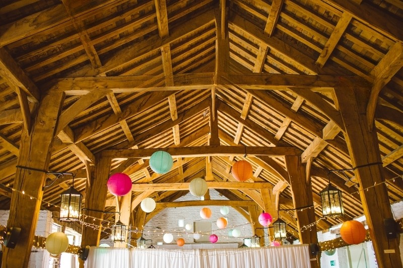 |
| Remove unwanted person | 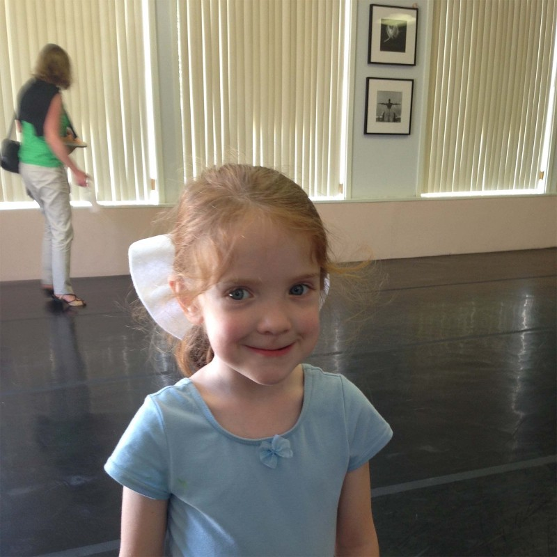  | 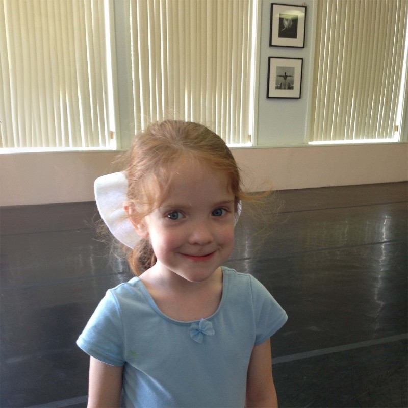  |
| Remove Text            |              |              |
| Remove watermark       | 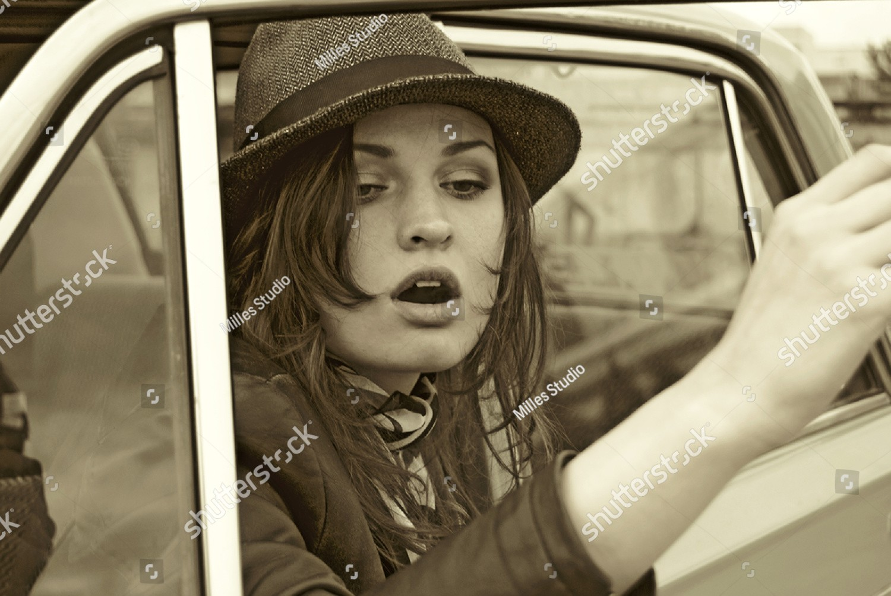          | 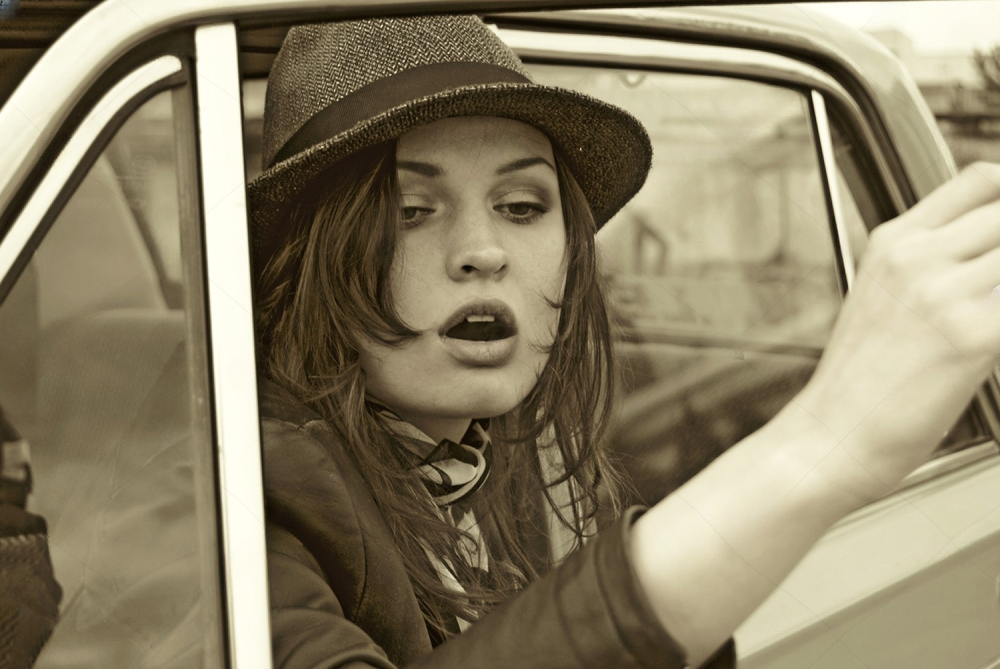  |

</details>

<details>
<summary>2. Fix old photo</summary>

| Usage         | Before                              | After                                           |
| ------------- | ----------------------------------- | ----------------------------------------------- |
| Fix old photo | 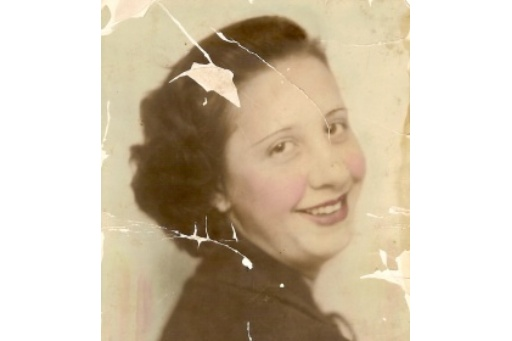 | 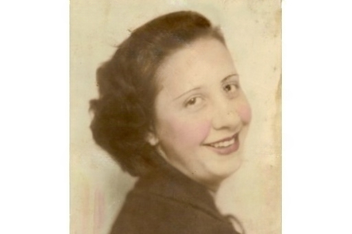 |

</details>

<details>
<summary>3. Replace something on the image </summary>

| Usage                  | Before                   | After                                                          |
| ---------------------- | ------------------------ | -------------------------------------------------------------- |
| Text Driven Inpainting | 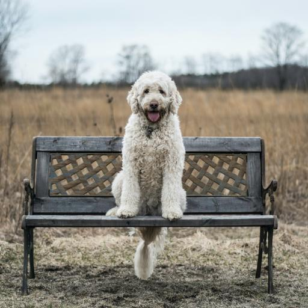 | Prompt: a fox sitting on a bench<br/> 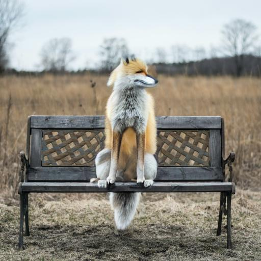 |

</details>

## Quick Start

The easiest way to use Lama Cleaner is to install it using `pip`:

```bash
pip install lama-cleaner

# Models will be downloaded at first time used
lama-cleaner --model=lama --device=cpu --port=8080
# Lama Cleaner is now running at http://localhost:8080
```

If you prefer to use docker, you can check out [docker](#docker)

Available command line arguments:

| Name                 | Description                                                                                                                   | Default  |
| -------------------- | ----------------------------------------------------------------------------------------------------------------------------- | -------- |
| --model              | lama/ldm/zits/mat/fcf/sd1.4 See details in [Inpaint Model](#inpainting-model)                                                 | lama     |
| --hf_access_token    | stable-diffusion(sd) model need [huggingface access token](https://huggingface.co/docs/hub/security-tokens) to download model |          |
| --sd-run-local       | Once the model as downloaded, you can pass this arg and remove `--hf_access_token`                                            |          |
| --sd-disable-nsfw    | Disable stable-diffusion NSFW checker.                                                                                        |          |
| --sd-cpu-textencoder | Always run stable-diffusion TextEncoder model on CPU.                                                                         |          |
| --device             | cuda or cpu                                                                                                                   | cuda     |
| --port               | Port for backend flask web server                                                                                             | 8080     |
| --gui                | Launch lama-cleaner as a desktop application                                                                                  |          |
| --gui_size           | Set the window size for the application                                                                                       | 1200 900 |
| --input              | Path to image you want to load by default                                                                                     | None     |
| --debug              | Enable debug mode for flask web server                                                                                        |          |

## Inpainting Model

| Model | Description                                                                                                                                                                                                            | Config                                                                                                                                                                                                                                                                            |
| ----- | ---------------------------------------------------------------------------------------------------------------------------------------------------------------------------------------------------------------------- | --------------------------------------------------------------------------------------------------------------------------------------------------------------------------------------------------------------------------------------------------------------------------------- |
| cv2   | :+1: No GPU is required, and for simple backgrounds, the results may even be better than AI models.                                                                                                                    |                                                                                                                                                                                                                                                                                   |
| LaMa  | :+1: Generalizes well on high resolutions(~2k)<br/>                                                                                                                                                                    |                                                                                                                                                                                                                                                                                   |
| LDM   | :+1: Possible to get better and more detail result <br/> :+1: The balance of time and quality can be achieved by adjusting `steps` <br/> :neutral_face: Slower than GAN model<br/> :neutral_face: Need more GPU memory | `Steps`: You can get better result with large steps, but it will be more time-consuming <br/> `Sampler`: ddim or [plms](https://arxiv.org/abs/2202.09778). In general plms can get [better results](https://github.com/Sanster/lama-cleaner/releases/tag/0.13.0) with fewer steps |
| ZITS  | :+1: Better holistic structures compared with previous methods <br/> :neutral_face: Wireframe module is **very** slow on CPU                                                                                           | `Wireframe`: Enable edge and line detect                                                                                                                                                                                                                                          |
| MAT   | TODO                                                                                                                                                                                                                   |                                                                                                                                                                                                                                                                                   |
| FcF   | :+1: Better structure and texture generation <br/> :neutral_face: Only support fixed size (512x512) input                                                                                                              |                                                                                                                                                                                                                                                                                   |
| SD1.4 | :+1: SOTA text-to-image diffusion model                                                                                                                                                                                |                                                                                                                                                                                                                                                                                   |

<details>
<summary> See model comparison detail</summary>

**LaMa vs LDM**

| Original Image                                                                                                                            | LaMa                                                                                                                                                   | LDM                                                                                                                                                   |
| ----------------------------------------------------------------------------------------------------------------------------------------- | ------------------------------------------------------------------------------------------------------------------------------------------------------ | ----------------------------------------------------------------------------------------------------------------------------------------------------- |
|  |  |  |

**LaMa vs ZITS**

| Original Image                                                                                                         | ZITS                                                                                                                       | LaMa                                                                                                                       |
| ---------------------------------------------------------------------------------------------------------------------- | -------------------------------------------------------------------------------------------------------------------------- | -------------------------------------------------------------------------------------------------------------------------- |
|  |  |  |

Image is from [ZITS](https://github.com/DQiaole/ZITS_inpainting) paper. I didn't find a good example to show the advantages of ZITS and let me know if you have a good example. There can also be possible problems with my code, if you find them, please let me know too!

**LaMa vs FcF**

| Original Image                                                                                                    | Lama                                                                                                                   | FcF                                                                                                                   |
| ----------------------------------------------------------------------------------------------------------------- | ---------------------------------------------------------------------------------------------------------------------- | --------------------------------------------------------------------------------------------------------------------- |
|  |  |  |

</details>

## Inpainting Strategy

Lama Cleaner provides three ways to run inpainting model on images, you can change it in the settings dialog.

| Strategy     | Description                                                                                            | VRAM   | Speed             |
| ------------ | ------------------------------------------------------------------------------------------------------ | ------ | ----------------- |
| **Original** | Use the resolution of the original image                                                               | High   | :zap:             |
| **Resize**   | Resize the image to a smaller size before inpainting. The area outside the mask will not loss quality. | Midium | :zap: :zap:       |
| **Crop**     | Crop masking area from the original image to do inpainting                                             | Low    | :zap: :zap: :zap: |

## Download Model Mannually

If you have problems downloading the model automatically when lama-cleaner start,
you can download it manually. By default lama-cleaner will load model from `TORCH_HOME=~/.cache/torch/hub/checkpoints/`,
you can set `TORCH_HOME` to other folder and put the models there.

- Github:
  - [LaMa](https://github.com/Sanster/models/releases/tag/add_big_lama)
  - [LDM](https://github.com/Sanster/models/releases/tag/add_ldm)
  - [ZITS](https://github.com/Sanster/models/releases/tag/add_zits)
  - [MAT](https://github.com/Sanster/models/releases/tag/add_mat)
  - [FcF](https://github.com/Sanster/models/releases/tag/add_fcf)
- Baidu:
  - https://pan.baidu.com/s/1vUd3BVqIpK6e8N_EA_ZJfw
  - passward: flsu

## Development

Only needed if you plan to modify the frontend and recompile yourself.

### Frontend

Frontend code are modified from [cleanup.pictures](https://github.com/initml/cleanup.pictures), You can experience their
great online services [here](https://cleanup.pictures/).

- Install dependencies:`cd lama_cleaner/app/ && yarn`
- Start development server: `yarn start`
- Build: `yarn build`

## Docker

You can use [pre-build docker image]() to run Lama Cleaner. The model will be downloaded to the cache directory when first time used.
You can mount existing cache directory to start the container,
so you don't have to download the model every time you start the container.

The cache directories for different models correspond as follows:

- lama/ldm/zits/mat/fcf: /root/.cache/torch
- sd1.4: /root/.cache/huggingface

### Run Docker (cpu)

```
docker run -p 8080:8080 \
-v /path/to/torch_cache:/root/.cache/torch \
-v /path/to/huggingface_cache:/root/.cache/huggingface \
--rm lama-cleaner:cpu-0.21.0 \
lama-cleaner --device=cpu --port=8080 --host=0.0.0.0
```

### Run Docker (gpu)

- cuda11.6
- pytorch1.12.1
- minimum nvidia driver 510.39.01+

```
docker run --gpus all -p 8080:8080 \
-v /path/to/torch_cache:/root/.cache/torch \
-v /path/to/huggingface_cache:/root/.cache/huggingface \
--rm lama-cleaner:cpu-0.21.0 \
lama-cleaner --device=cuda --port=8080 --host=0.0.0.0
```

Then open [http://localhost:8080](http://localhost:8080)

### Build Docker image

cpu only

```
docker build -f ./docker/CPUDockerfile -t lamacleaner .
```

gpu & cpu

```
docker build -f ./docker/GPUDockerfile -t lamacleaner .
```

## One Click Installer

TODO
